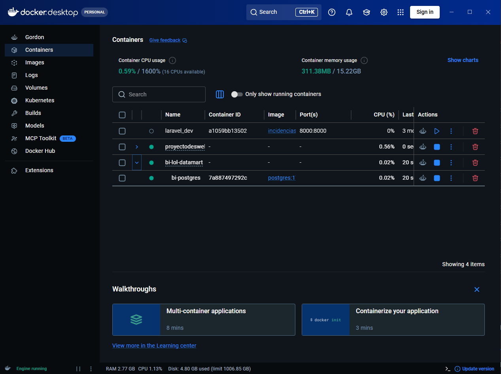
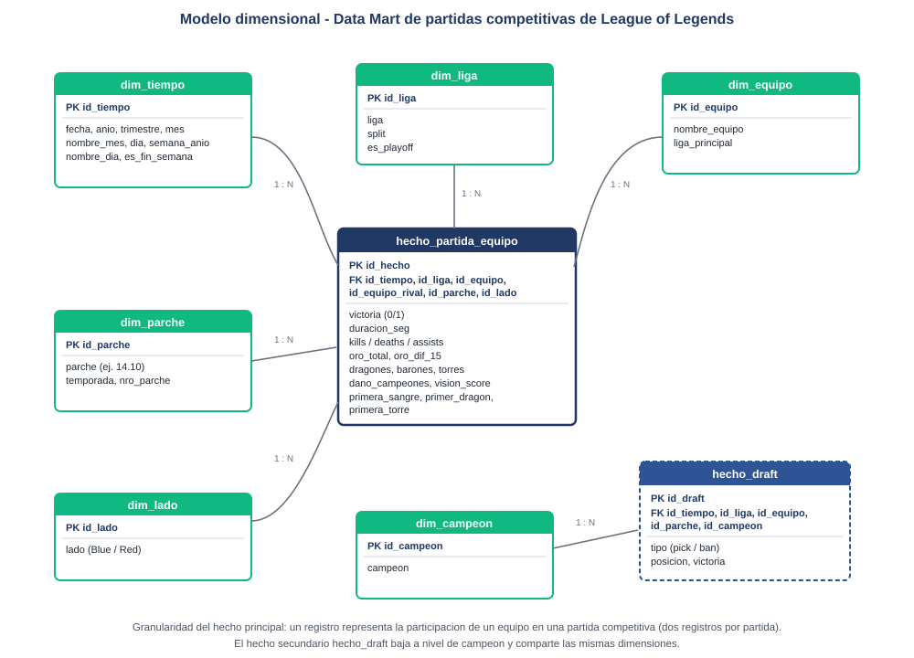

# Data Mart — League of Legends competitivo 2024

Proyecto de la asignatura **Inteligencia de Negocios** (UPSE, Carrera de Ingeniería de Software).

Construcción de un Data Mart en PostgreSQL a partir del dataset público de partidas
competitivas de League of Legends 2024 (Oracle's Elixir), publicado en Kaggle.

**Autora:** Diana Lucía Melena Santander

---

## Dataset

- **Fuente:** [League of Legends 2024 Competitive Game dataset](https://www.kaggle.com/datasets/barthetur/league-of-legends-2024-competitive-game-dataset) (Kaggle)
- **Origen primario:** [Oracle's Elixir](https://oracleselixir.com)
- **Período:** temporada competitiva 2024
- **Granularidad original:** 12 filas por partida (10 de jugador y 2 de resumen por equipo)

---

## Requisitos

- Docker y Docker Compose
- Python 3.10 o superior con `pandas` y `openpyxl` (`pip install pandas openpyxl`)

---

## Puesta en marcha

```bash
# 1. Levantar PostgreSQL 17
docker compose up -d

# 2. Limpiar el dataset y generar los CSV de carga (se ejecuta en el host)
python 02_limpieza.py

# 3. Crear el modelo dimensional
docker compose exec postgres psql -U bi_user -d bi_database -f /proyecto/01_modelo.sql

# 4. Cargar los datos
docker compose exec postgres psql -U bi_user -d bi_database -f /proyecto/03_carga.sql

# 5. Validar la carga
docker compose exec postgres psql -U bi_user -d bi_database -f /proyecto/04_validaciones.sql

# 6. Crear vistas y funciones
docker compose exec postgres psql -U bi_user -d bi_database -f /proyecto/05_vistas_funciones.sql
```

Para apagar el entorno: `docker compose down`
(los datos persisten en el volumen `postgres_data`; usar `down -v` para borrarlos).

Contenedor `bi-postgres` en ejecución dentro del proyecto `bi-lol-datamart`:



### Conexión

| Parámetro | Valor |
|---|---|
| Host | localhost |
| Puerto | 5432 |
| Base de datos | bi_database |
| Usuario | bi_user |
| Contraseña | bi_password |
| Esquema | dm |

---

## Estructura del repositorio

```
.
├── docker-compose.yml        Contenedor de PostgreSQL 17
├── 01_modelo.sql             Esquema dm: dimensiones, hechos, PK, FK e índices
├── 02_limpieza.py            Limpieza del CSV de Kaggle y generación de los CSV de carga
├── 03_carga.sql              Staging, \copy y poblado del modelo
├── 04_validaciones.sql       Conteos, integridad referencial, nulos y totales
├── 05_vistas_funciones.sql   4 vistas y 3 funciones para el dashboard
├── assets/
│   └── diagrama_estrella.svg Diagrama del modelo dimensional
├── dashboard/                Mockup navegable del dashboard (HTML, CSS y JS)
│   ├── index.html
│   ├── styles.css
│   └── app.js
├── docs/                     Documentos de los entregables (Word)
└── capturas/                 Evidencias de ejecución
```

---

## Dashboard

Mockup publicado en GitHub Pages:
**https://misstery13.github.io/bi-lol-datamart/dashboard/**

Los valores son ilustrativos; cada componente indica la vista o función SQL que lo alimenta.

---

## Evidencias de ejecución

| Captura | Contenido |
|---|---|
| [docker_contenedor.png](capturas/docker_contenedor.png) | Contenedor `bi-postgres` en Docker Desktop |
| [01_limpieza.png](capturas/01_limpieza.png) | Salida de `02_limpieza.py` |
| [02_carga.png](capturas/02_carga.png) | Salida de `03_carga.sql` |
| [03_validaciones_conteo_integridad.png](capturas/03_validaciones_conteo_integridad.png) | Validaciones V1 a V3 |
| [04_validaciones_nulos_totales.png](capturas/04_validaciones_nulos_totales.png) | Validaciones V4 y V5 |
| [05_vistas_funciones.png](capturas/05_vistas_funciones.png) | Consultas a vistas y funciones |

---

## Modelo dimensional



**Granularidad del hecho principal:** un registro de `hecho_partida_equipo` representa
la participación de un equipo en una partida competitiva (dos registros por partida).

| Objeto | Tipo |
|---|---|
| `dim_tiempo` | Dimensión — un registro por día |
| `dim_liga` | Dimensión — liga, split y fase |
| `dim_equipo` | Dimensión |
| `dim_parche` | Dimensión — versión del juego |
| `dim_lado` | Dimensión — lado azul o rojo |
| `dim_campeon` | Dimensión |
| `hecho_partida_equipo` | Hechos — equipo por partida |
| `hecho_draft` | Hechos — campeón elegido o baneado por equipo y partida |

---

## KPI

| KPI | Objeto SQL |
|---|---|
| Tasa de victoria | `vw_kpi_equipo`, `fn_tasa_victoria()` |
| Presencia en el draft | `vw_presencia_campeon`, `fn_top_campeones()` |
| Diferencia de oro al minuto 15 | `vw_ventaja_temprana`, `fn_evolucion_equipo()` |

---

## Nota académica

Trabajo desarrollado con fines educativos. Los datos pertenecen a Oracle's Elixir y
League of Legends es una marca registrada de Riot Games.
